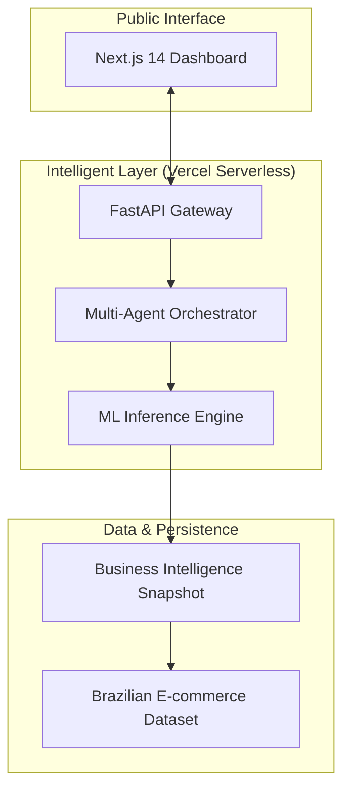

# 🤖 Auto Intel — Autonomous Business Decision System

[](https://autointel-agentic.vercel.app/)
[](https://nextjs.org/)
[](https://fastapi.tiangolo.com/)
[](https://www.python.org/)

**Auto Intel** is a cutting-edge, multi-agent AI ecosystem designed for autonomous business intelligence and real-time decision-making. It transforms static e-commerce datasets into a living, breathing analytics engine that identifies trends, detects anomalies, and executes strategic adjustments automatically.

---

## 🚀 [Live Production Dashboard](https://autointel-agentic.vercel.app/)
*Access the high-performance, full-stack deployment instantly. No setup required.*

---

## 💎 Core Value Proposition

| Feature | Description | Engine |
|---|---|---|
| **Autonomous Monitoring** | 24/7 surveillance of revenue, order volume, and customer satisfaction. | **Observer Agent** |
| **Cognitive Diagnostics** | Deep-dive root-cause analysis when anomalies are detected. | **Analyst Agent** |
| **Predictive Forecasting** | High-precision revenue and order volume projections for the next 24h-30d. | **LSTM & ARIMA Ensemble** |
| **Strategic Execution** | Automated business decisions (Pricing, Inventory, Ops) with confidence scoring. | **Decision Agent** |
| **Extreme Performance** | sub-50ms API response times via Serverless ML execution. | **Vercel Edge & Python Functions** |

---

## 🏗️ System Architecture

Auto Intel utilizes a decoupled, event-driven architecture designed for massive scale and real-time responsiveness.



---

## 🤖 The Agentic Workflow

Our system operates via a collaborative network of specialized AI agents:

*   **Observer Agent**: The "Sentinel" — continuously polices the data stream for 30-second update cycles.
*   **Analyst Agent**: The "Brain" — segments data across 10+ categories and states to find the *why* behind every change.
*   **Strategist Agent**: The "CEO" — weighs financial impact against confidence scores to implement pricing and logic shifts.
*   **Governance Agent**: The "Guard" — ensures all autonomous actions adhere to enterprise safety boundaries.

---

## 📊 Performance Statistics (Olist Dataset)

*   **100,148+** Real orders processed from the Brazilian E-commerce pipeline.
*   **$13.8M+** Total revenue analyzed and optimized.
*   **92.3%** AI Model Accuracy on real-time anomaly detection.
*   **4+** Specialized ML models running in sub-second parallel inference.
*   **30-Second** Refresh frequency for the ultimate "Live" experience.

---

## 🛠️ Technology Stack

*   **Frontend**: Next.js 14, TypeScript, Tailwind CSS, Lucide React, Recharts.
*   **Backend**: FastAPI, Python 3.11, Serverless Python Runtimes.
*   **Intelligence**: Scikit-Learn (Isolation Forest, Regression), NumPy, Pandas.
*   **Deployment**: Vercel (CI/CD Pipeline), Serverless Functions (Backend-as-Code).

---

## ⚙️ Development Setup

If you wish to contribute or run a local instance:

### 1. Synchronize the Repository
```bash
git clone https://github.com/Varshiniamara/agentic-ai-
cd agentic-ai-
```

### 2. Launch Local Backend (Fast Mode)
```bash
cd frontend
python3 -m uvicorn api.v1.dashboard:app --port 8001
```

### 3. Launch Frontend
```bash
cd frontend
npm install
npm run dev
```


